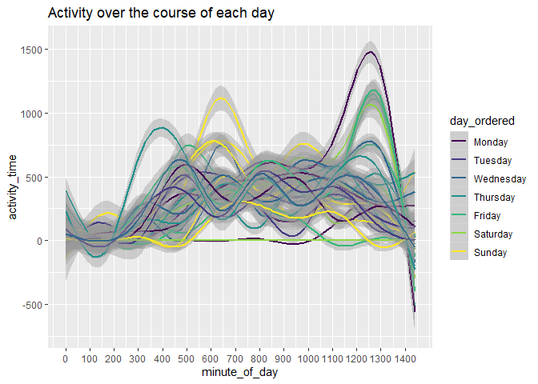

p8105\_hw3\_fw2334
================
Frances Williams
10/7/2019

# Problem 1

``` r
library(p8105.datasets)
data("instacart") 
```

``` r
aisle_df = instacart %>% 
  group_by(aisle) %>% 
  summarize(item_count = n()) %>% 
  arrange(desc(item_count))
```

There are 134 aisles. The most items are ordered from `fresh vegetables`
and `fresh fruits`.

``` r
aisle_plot = aisle_df %>%
  filter(item_count >= 10000) %>% 
  mutate(aisle = fct_reorder(aisle, item_count)) %>% 
  ggplot(aes(x = aisle, y = item_count)) +
    geom_bar(stat = "identity") +
    coord_flip()

aisle_plot
```

<!-- -->

### Table

``` r
aisles_table = instacart %>%
  filter(aisle == c("baking ingredients", "dog food care", "packaged vegetables fruits")) %>% 
  group_by(aisle, product_name) %>% 
  summarize(product_name_count = n()) %>% 
  mutate(product_rank = min_rank(-product_name_count)) %>% 
  filter(product_rank <= 3) %>% 
  mutate(product_info = paste(product_name, product_name_count, sep = ", n = ")) %>% 
  select(-product_name, -product_name_count) %>% 
  pivot_wider(
    names_from = aisle,
    values_from = product_info)

knitr::kable(aisles_table)
```

| product\_rank | baking ingredients               | dog food care                                           | packaged vegetables fruits     |
| ------------: | :------------------------------- | :------------------------------------------------------ | :----------------------------- |
|             1 | Light Brown Sugar, n = 157       | Organix Grain Free Chicken & Vegetable Dog Food, n = 14 | Organic Baby Spinach, n = 3324 |
|             3 | Organic Vanilla Extract, n = 122 | Original Dry Dog, n = 9                                 | Organic Blueberries, n = 1692  |
|             2 | Pure Baking Soda, n = 140        | Organix Chicken & Brown Rice Recipe, n = 13             | Organic Raspberries, n = 1920  |

### Pink Lady Apples and Coffee Ice Cream

``` r
apples_icecream_table = instacart %>% 
  select(product_name, order_dow, order_hour_of_day) %>% 
  filter(product_name == "Pink Lady Apples" | product_name == "Coffee Ice Cream") %>% 
  group_by(product_name, order_dow) %>% 
  mutate(mean_hour = mean(order_hour_of_day)) %>% 
  select(-order_hour_of_day) %>% 
  distinct() %>% 
  pivot_wider(
    names_from = product_name,
    values_from = mean_hour)

knitr::kable(apples_icecream_table)
```

| order\_dow | Pink Lady Apples | Coffee Ice Cream |
| ---------: | ---------------: | ---------------: |
|          3 |         14.25000 |         15.31818 |
|          2 |         11.70213 |         15.38095 |
|          1 |         11.36000 |         14.31579 |
|          6 |         11.93750 |         13.83333 |
|          4 |         11.55172 |         15.21739 |
|          0 |         13.44118 |         13.77419 |
|          5 |         12.78431 |         12.26316 |

# Problem 2

``` r
data("brfss_smart2010")

brfss_cleaned = brfss_smart2010 %>% 
  janitor::clean_names() %>%
  filter(topic == "Overall Health") %>% 
  mutate(
    state = locationabbr,
    response_f = as.factor(response),
    response_ordered = ordered(response_f, levels = c("Poor", "Fair", "Good", "Very good", "Excellent")))
```

### States at 7 or more locations

``` r
brfss_excellent = brfss_cleaned %>% 
  filter(response == "Excellent") %>% 
  select(year, state, data_value) %>% 
  group_by(year, state) %>% 
  summarize(mean_value = mean(data_value, na.rm = TRUE)) %>%
  ggplot(aes(x = year, y = mean_value, group = state, color = state)) +
    geom_line()

brfss_excellent
```

<!-- -->

``` r
brfss_ny = brfss_cleaned %>% 
  filter(
    state == "NY",
    year == "2006" | year == "2010") %>% 
  select(year, state, response_ordered, data_value) %>% 
  group_by(year, response_ordered) %>% 
  ggplot(aes(x = response_ordered, y = data_value)) +
    geom_point() +
    facet_grid(~year)

brfss_ny
```

<!-- -->

# Problem 3

``` r
accel_df = read_csv(file = "./data/accel_data.csv") %>% 
  janitor::clean_names() %>% 
  mutate(
    day_type = ifelse(day == "Saturday" | day == "Sunday", "weekend", "weekday"),
    day_f = as.factor(day),
    day_ordered = ordered(
      day_f, levels = c("Monday", "Tuesday", "Wednesday", "Thursday", "Friday", "Saturday", "Sunday")))
```

    ## Parsed with column specification:
    ## cols(
    ##   .default = col_double(),
    ##   day = col_character()
    ## )

    ## See spec(...) for full column specifications.

This dataset has 35 observations.

``` r
accel_total = accel_df %>% 
  mutate(total_activity = 
           select(., activity_1:activity_1440) %>% 
           rowSums(na.rm = TRUE)) %>% 
  select(day_ordered, total_activity)  %>% 
  group_by(day_ordered) %>% 
  summarize(total_activity = sum(total_activity))

knitr::kable(accel_total)
```

| day\_ordered | total\_activity |
| :----------- | --------------: |
| Monday       |         1858699 |
| Tuesday      |         1799238 |
| Wednesday    |         2129772 |
| Thursday     |         2091151 |
| Friday       |         2291711 |
| Saturday     |         1369237 |
| Sunday       |         1919213 |

``` r
accel_24hr = accel_df %>% 
  select(day_ordered, activity_1:activity_1440) %>% 
  pivot_longer(
    activity_1:activity_1440,
    names_to = "minute_in_day",
    values_to = "activity_time") %>% 
  ggplot(aes(x = minute_in_day, y = activity_time, group = day_ordered, color = day_ordered)) +
    geom_point()

accel_24hr
```

<!-- -->
